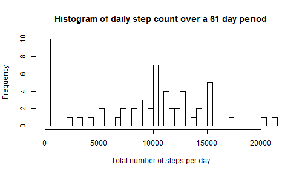
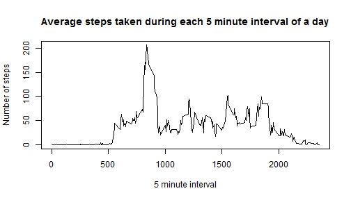
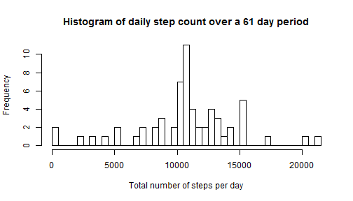
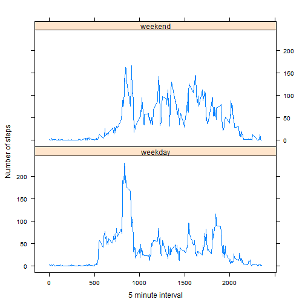

# Reproducible Research: Peer Assessment 1

The following analysis examines patterns in activity of an anonymous individual during October and November 2012. The number of steps the individual took was recorded through a personal activity monitoring device in 5-minute intervals each day. The data for this project are available for download in [this zip file] (https://d396qusza40orc.cloudfront.net/repdata%2Fdata%2Factivity.zip).

## Loading and preprocessing the data

Prior to analysis, the data are first read into R from the workind directory, and the first six rows of the dataset are printed.

```r
setwd("C:/Users/Jantina/Documents/University/Coursera/5.ReproducibleResearch")
data <- read.csv("activity.csv", stringsAsFactors = FALSE)
head(data)
```

```
##   steps       date interval
## 1    NA 2012-10-01        0
## 2    NA 2012-10-01        5
## 3    NA 2012-10-01       10
## 4    NA 2012-10-01       15
## 5    NA 2012-10-01       20
## 6    NA 2012-10-01       25
```

A brief summary shows that there are some missing values ("NA") for the number of steps ("steps") in this data set.

## What is mean total number of steps taken per day?

The dataset is divided up by date (61 days total), and the total number of steps per day is calculated, ignoring any missing values. A histogram of the daily totals is generated.

```r
s <- split(data, data$date)
dailytotals <- sapply(s, function(x) sum(x[, "steps"], na.rm = TRUE))
hist(dailytotals, breaks = 50, main = "Histogram of daily step count over a 61 day period", 
    xlab = "Total number of steps per day")
```

 

The mean and median daily step totals were also calculated.

```r
meansteps <- mean(dailytotals)
meansteps
```

```
## [1] 9354
```

```r
mediansteps <- median(dailytotals)
mediansteps
```

```
## [1] 10395
```

For this individual, the mean total number of steps per day was 9354.2295, and the median total number of steps per day was 10395.

## What is the average daily activity pattern?

The dataset is divided up by 5-minute intervals (288 total), and the mean number of steps per interval is calculated, ignoring any missing values. A scatterplot of the average number of steps as a function of 5-minute intervals is generated.

```r
s2 <- split(data, data$interval)
intervalavg <- sapply(s2, function(x) mean(x[, "steps"], na.rm = TRUE))
int <- unique(data$interval)  ## vector with one set of 5-min intervals
plot(int, intervalavg, type = "l", main = "Average steps taken during each 5 minute interval of a day", 
    xlab = "5 minute interval", ylab = "Number of steps")
```

 

Based on the scatterplot, there is a clear peak in average steps between intervals 500 and 1000. The maximum average number of steps is calculated to determine in exactly which interval activity is highest.

```r
maxsteps <- max(intervalavg)
maxinterval <- int[intervalavg == maxsteps]
maxinterval
```

```
## [1] 835
```

The 835th 5-minute interval exhibits the maximum average number of steps for this individual. 

## Imputing missing values

To deal with the effect of missing values on the data analysis, first the number of missing "steps" values are calculated.

```r
NAsteps <- is.na(data$steps)
totalNAsteps <- length(NAsteps[NAsteps == TRUE])
totalNAsteps
```

```
## [1] 2304
```

Within the dataset, there are 2304 intervals with missing data (i.e. steps = NA).

The following code replaces all values of NA with the mean number of steps for the respective 5-minute interval, and displays the first 6 rows of this updated dataset.

```r
## Generate vector that repeats the average steps/5-minute interval for each
## of the 61 days in the dataset.
meanvect <- rep(intervalavg, 61)
steps <- data$steps  ## Subsets out steps data from dataset
## Replace all NA values with the mean value for that interval
for (i in 1:length(NAsteps)) {
    if (NAsteps[i] == TRUE) 
        steps[i] <- meanvect[i]
}
## Replace the original 'steps' column with the newly defined 'steps' vector
## above
data2 <- data.frame(cbind(steps, data))  ## adds new 'steps' column to left of dataframe
data3 <- data2[, c(1, 3, 4)]  ## removes original 'steps'' column (the one with NA values)
head(data3)
```

```
##     steps       date interval
## 1 1.71698 2012-10-01        0
## 2 0.33962 2012-10-01        5
## 3 0.13208 2012-10-01       10
## 4 0.15094 2012-10-01       15
## 5 0.07547 2012-10-01       20
## 6 2.09434 2012-10-01       25
```

Based on this modified dataset, a histogram of daily total steps is generated in a similar manner to the histogram above.

```r
s3 <- split(data3, data3$date)
dailytotals3 <- sapply(s3, function(x) sum(x[, "steps"]))
hist(dailytotals3, breaks = 50, main = "Histogram of daily step count over a 61 day period", 
    xlab = "Total number of steps per day")
```

 

The mean and median of this modified dataset are also calculated.

```r
meansteps3 <- mean(dailytotals3)
meansteps3
```

```
## [1] 10766
```

```r
mediansteps3 <- median(dailytotals3)
mediansteps3
```

```
## [1] 10766
```

When missing values are replaced by the mean number of steps for that interval, the mean total number of steps per day changes to 1.0766 &times; 10<sup>4</sup>, while the median total number of steps per day changes to 1.0766 &times; 10<sup>4</sup>.

## Are there differences in activity patterns between weekdays and weekends?

To examine differences between activity on weekdays vs. weekends, a new vector is first created to classify each date as either "weekday" or "weekend".

```r
dates <- as.Date(data$date)  ## Converts date column from into correct date format
daytype <- weekdays(dates)  ## Coverts dates to days of the week
## A for loop replaces all Saturdays and Sundays with 'weekend', and Mondays
## through Fridays with 'weekday'
for (i in 1:length(dates)) {
    if (daytype[i] == "Saturday" | daytype[i] == "Sunday") 
        daytype[i] <- "weekend" else daytype[i] <- "weekday"
}
```

The dataset is then divided into groups using the weekend/weekday distinction, as well as the intervals. Then the average number of steps per interval is calculates for both weekdays and weekends.

```r
f1 <- factor(daytype)  ## weekday vs. weekend factor
f2 <- factor(data3$interval)  ## interval factor
s4 <- split(data3, list(f2, f1))
avgsteps <- sapply(s4, function(x) mean(x[, "steps"], na.rm = TRUE))
length(avgsteps)
```

```
## [1] 576
```

The first half of "avgsteps" represents average steps for intervals on weekdays. The second half of the dataset represents average steps for intervals on weekends.

With the averages calculated, a smaller dataset is generated by adding two vectors of the same length as avgsteps: 
* one with two iterations of the 288 5-min intervals,
* and one with 288 iterations each of weekday and weekend.
The first six rows of this dataset are shown below.

```r
int <- rep(unique(data3$interval), 2)
daylabel <- c(rep("weekday", 288), rep("weekend", 288))
data4 <- data.frame(cbind(avgsteps, int, daylabel))
head(data4)
```

```
##                      avgsteps int daylabel
## 0.weekday    2.25115303983228   0  weekday
## 5.weekday   0.445283018867925   5  weekday
## 10.weekday  0.173165618448637  10  weekday
## 15.weekday    0.1979035639413  15  weekday
## 20.weekday 0.0989517819706499  20  weekday
## 25.weekday   1.59035639412998  25  weekday
```

A plot is generated from the above dataset, comparing average steps per 5-minute interval on weekdays vs. weekends.

```r
library(lattice)
xyplot(avgsteps ~ int | daylabel, layout = c(1, 2), type = "l", xlab = "5 minute interval", 
    ylab = "Number of steps")
```

 

It is clear that activity patterns differ (on average) between weekdays and weekends for this individual. They appear to be active over a longer time period on weekends, while activity predominantly occurs in one short period on weekdays.
